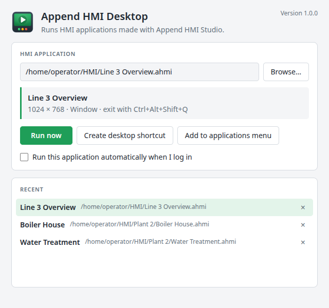

Append HMI Desktop
==================

**Append HMI Desktop** runs HMI applications (`.ahmi` projects) made with [Append HMI Studio](https://github.com/AppendAutomation/AppendHMIStudio) on operator PCs. It's the Studio's runtime without the editor: nothing can be edited, saved, exported or published, which makes it smaller and simpler to deploy.



- **Run from the command line:** `append-hmi-desktop project.ahmi` runs a project.
- **Run from the launcher:** with no project, a window opens where you pick an `.ahmi` file, then:
  - **Run now**;
  - create a **desktop shortcut** or a **Start menu / applications menu entry** that runs it;
  - tick **Run automatically when I log in**.
- **Each project runs as its author set it up** in Studio (HMI > Application Settings):
  - kiosk, full screen or a window at the project's resolution;
  - exit with Ctrl+Alt+Shift+Q, with Ctrl+Alt+Shift+Q and a password, or not at all.
- **Several projects at once**, one window each (for example one per monitor). Starting a project that is already running brings its window forward.
- **Everything the Studio's Run does** comes with it:
  - live PLC data through the bundled `hmi-comms` server (EtherNet/IP ControlLogix/CompactLogix, SLC 5/05 and MicroLogix, Modbus TCP, simulator);
  - alarms with daily CSV history;
  - retentive tags;
  - users and access levels;
  - recipes, with CSV export and import.
  - Each project keeps its own history, retentive values, runtime user changes and saved recipes.

Command line
------------

```
append-hmi-desktop [options] [project.ahmi]

  --create-shortcut <where>  Create a shortcut that runs the project, then exit
                             (<where>: desktop or menu).
  --startup <on|off>         Run the project when the user logs in, or stop, then exit.
  --disable-acceleration     Turn off GPU acceleration.
  -h, --help                 Show help.
  -v, --version              Show the version.
```

- **Exit codes:** 0 on success, 1 when the project can't be used, 2 for a usage error.
- **Windows executable:** `C:\Program Files\Append HMI Desktop\Append HMI Desktop.exe`.

Shortcuts and startup entries are per user and need no administrator rights:

| | Windows | Linux |
|---|---|---|
| Desktop shortcut | `Desktop\<project>.lnk` | `~/Desktop/append-hmi-desktop-<project>-<id>.desktop` |
| Menu entry | Start menu > Programs > Append HMI Desktop | `~/.local/share/applications/` |
| Run at login | `Start Menu\Programs\Startup\<project>.lnk` | `~/.config/autostart/` |

Opening `.ahmi` files
---------------------

- **Windows installer:**
  - adds **Run with Append HMI Desktop** to the right-click menu of every `.ahmi` file;
  - makes double-click run the project only when nothing else opens `.ahmi` files. With Append HMI Studio installed, double-click still opens the project in the Studio for editing.
- **Linux packages:** Append HMI Desktop is offered under **Open With** for `.ahmi` files.

Download
--------

Releases are published at [github.com/AppendAutomation/AppendHMIDesktop/releases](https://github.com/AppendAutomation/AppendHMIDesktop/releases):

- `Append-HMI-Desktop-<version>-Setup.exe`
  - Windows 10/11 x64, for all users.
  - Silent install: `/S`. Silent uninstall: `"C:\Program Files\Append HMI Desktop\Uninstall.exe" /S`.
- `Append-HMI-Desktop-<version>-x86_64.AppImage`: Linux, runs without installing.
- `Append-HMI-Desktop-<version>-amd64.deb`: Debian and Ubuntu.

The installers are not code-signed yet, so Windows SmartScreen asks for confirmation on first run.

Settings, logs and project data are kept in:
- `%APPDATA%\Append HMI Desktop` on Windows;
- `~/.config/Append HMI Desktop` on Linux.

The log is `logs/main.log`.

Desktop or Publish?
-------------------

Append HMI Studio's **HMI > Publish** builds a Windows installer for one project, with its own name and icon, that starts straight into that project. Append HMI Desktop is installed once and runs any project file you give it. Use Publish for a locked-down, single-purpose station; use Desktop when projects are copied around or change often, or on Linux.

What's left out
---------------

Append HMI Desktop reuses Append HMI Studio's run-only renderer, comms server and data stores unchanged, from the `studio/` submodule. Everything only the editor needs is left out:

- **Web app:** 46 MB of the editor's 156 MB (`app.asar` 40 MB instead of 106 MB).
  - Out: the unminified editor sources, stencil XML, templates, the viewer and embed bundles, translations and source maps.
  - In: the image libraries a project's images may use.
- **Studio's main process:** replaced by a small one.
  - Out: file editing, drafts, PDF/SVG export, the Publish template and NSIS, the automation CLI, the settings and context-menu libraries.
  - The only runtime dependency is `electron-log`.
- **Chromium translations:** English only.

Result: installers of about 130 MB instead of 166 MB (Windows), and a 150 MB AppImage instead of 348 MB. Most of what remains is Electron itself.

Building
--------

With Node.js 22.12+ and the .NET 8 SDK:

```
git clone --recursive https://github.com/AppendAutomation/AppendHMIDesktop.git
cd AppendHMIDesktop
npm install
npm run build-comms       # the hmi-comms server, into studio/comms/publish/
npm start                 # the launcher; npm start -- path/to/project.ahmi runs one
npm test
npm run dist-win          # Windows installer (on Linux too, no wine)
npm run dist-linux        # AppImage and deb
```

- **Dev tools:** `HMI_ENV=dev npm start` opens DevTools.
- **Updating the Studio:** move the `studio` submodule to a newer AppendHMIStudio commit to pick up runtime changes, then rebuild:
  `git -C studio pull && git submodule update --init --recursive`.

| Path | Contents |
|---|---|
| `src/main/` | Main process: command line, launcher and project windows, shortcuts, the runtime's IPC |
| `src/launcher/` | The launcher window (plain HTML, no editor code) |
| `studio/` | Submodule: [AppendHMIStudio](https://github.com/AppendAutomation/AppendHMIStudio), with its drawio fork and comms server |
| `scripts/` | Build scripts: installers, NSIS download, icons |
| `build/` | Icons and the Electron fuses hook |
| `src/test/` | Unit tests (`npm test`) |

License and attribution
-----------------------

Append HMI Desktop is © 2026 Append Automation and is licensed under the Apache License 2.0 (see [LICENSE](LICENSE)).

It is built on Append HMI Studio, which is built on the [draw.io](https://github.com/jgraph/drawio) diagram editor and [drawio-desktop](https://github.com/jgraph/drawio-desktop) by JGraph Ltd, used and modified under the Apache License 2.0. [NOTICE](NOTICE) lists the third-party works. Append HMI Desktop is not affiliated with or endorsed by JGraph Ltd; "draw.io" is a trademark of its owner.
